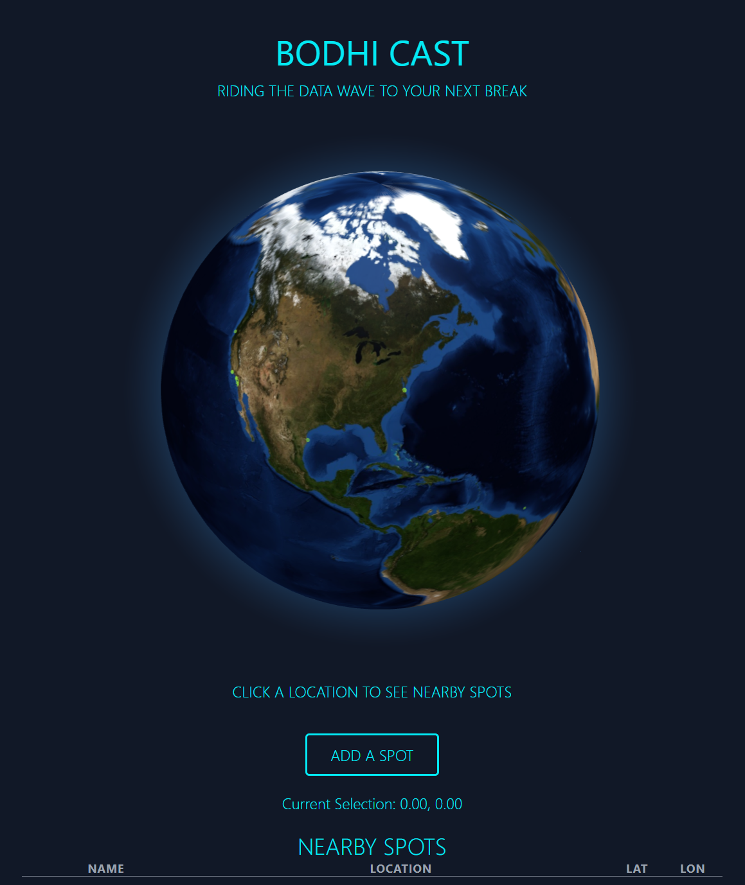
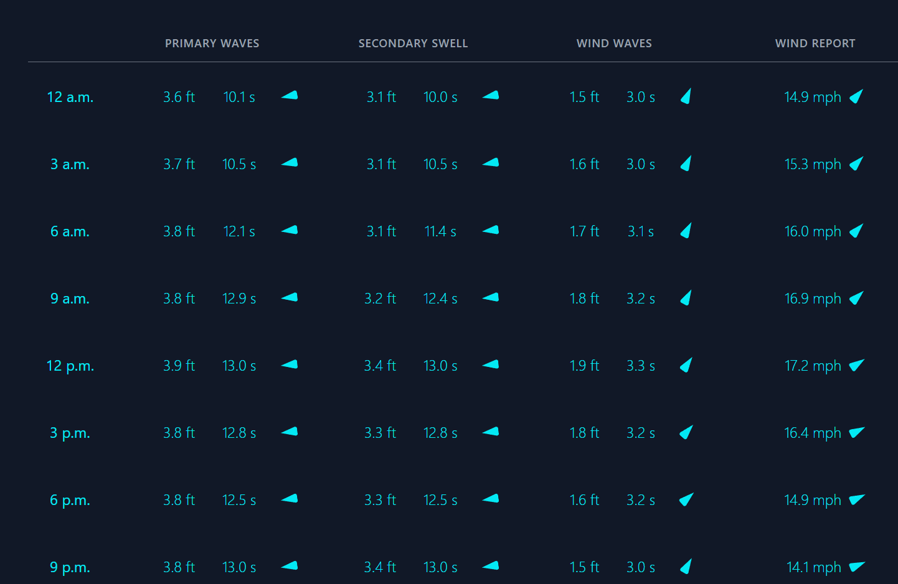
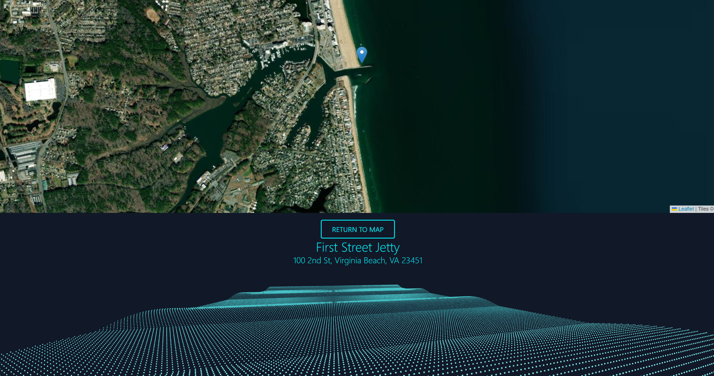

# Bodhi-Cast

Welcome to Bodhi-Cast, an innovative open-source application designed for surf enthusiasts and professionals around the globe. Bodhi-Cast offers comprehensive swell and surf forecasting, enabling users to explore and analyze surf conditions anywhere in the world.

## Introduction

Bodhi-Cast is more than just a surf forecasting app; it's your go-to platform for discovering and assessing surf spots with ease and precision. With the ability to select any location from a map, users can add surf spots and receive detailed forecasts including primary swell, secondary swell, wind waves, and wind speed/direction.

Bodhi-Cast brings surf data to life with animated visualizations. Utilizing Three.js, the app generates captivating animations that depict wave height and period based on the primary swell, offering a quick and visually engaging way to evaluate surf conditions at a glance.

## Features

- **Global Surf Spot Discovery:** Choose any location on the map to explore surf conditions.
  
- **Comprehensive Data Forecasts:** Get detailed information on primary and secondary swells, wind waves, and wind speed/direction.
  
- **Animated Wave Visualizations:** Visualize surf data with animated representations of wave height and period, powered by Three.js.
  

## Getting Started

Setting up Bodhi-Cast in your local development environment is straightforward, thanks to Docker and Docker Compose. Follow the steps below to get started.

### Prerequisites

- A Windows, Mac, or Linux environment.
- Docker and Docker Compose installed on your machine.

### Installation

Clone the Bodhi-Cast repository from GitHub:

```bash
git clone https://github.com/peterbull/bodhi-cast
```

Navigate to the project directory and create env file:

```bash
cd bodhi-cast
cp .env.example .env
```

Build and run the docker containers:
(_This will run the app with the docker override file that includes debug for `backend` and `airflow-worker`_)

```bash
docker compose up --build
```

### Default Locations

- **Frontend:** Access the Bodhi-Cast user interface at [http://localhost:3001](http://localhost:3001). This is where you can explore surf spots, view forecasts, and interact with the animated visualizations.
- **Backend:** The backend API can be accessed at [http://localhost:8000](http://localhost:8000). This serves as the backbone of Bodhi-Cast, handling data processing, forecasting, and API requests.
- **Airflow Webserver:** For managing and monitoring your workflows, visit the Airflow webserver at [http://localhost:8080](http://localhost:8080). This tool is crucial for orchestrating the data pipeline tasks that power the forecasts in Bodhi-Cast.

## To Do:

## Long-Term:

### Frontend:

- [ ] Add user auth
- [x] Add user spot creation pin drop
- [ ] Add brief instructions on pages where needed
- [ ] Change marker system on globe component

### Backend:

- [ ] Get tide forecast
- [ ] Get shore wind forecast
- [x] Change data fetching utils to classes
- [x] Add tests for all endpoints
- [ ] Add API auth
- [x] Add user spot creation endpoint

### Airflow:

### Week Ending 240121

- [x] Add basic wave visualization component in three.js using `swh` data

### Week Ending 240128

- [x] Migrate data pipeline to airflow
- [x] Downgrade to SQLAlchemy 1.4
- [x] Merge Docker compose services with airflow
- [x] Extend airflow image to correctly install ECCodes for use of cfgrib engine in data processing

### Week Ending 240204

- [x] Set up kafka for streams
- [x] Configure DAGs for production
- [x] Set up env for production
- [x] Add auto tests for data verification as DAGs

```

```
