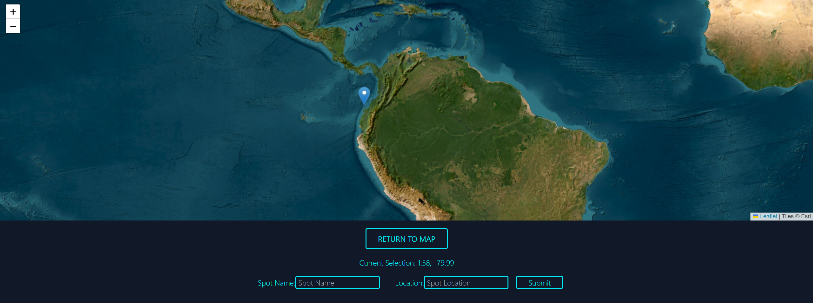
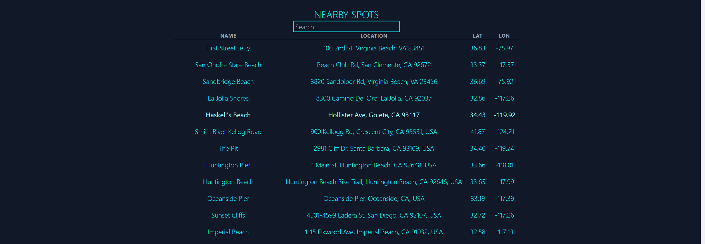
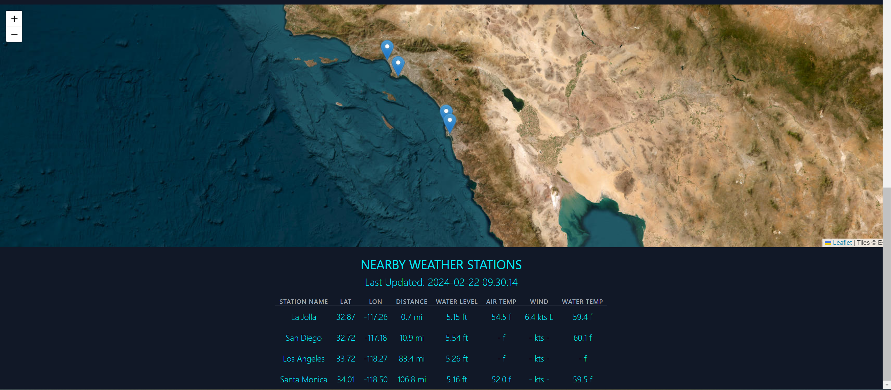

# Bodhi-Cast


Welcome to Bodhi-Cast, an open-source application designed for surf enthusiasts around the globe. Bodhi-Cast offers comprehensive swell and surf forecasting along with real-time weather conditions, enabling users to explore and analyze surf conditions anywhere in the world.

1. [Introduction](#introduction)
2. [Features](#features)
3. [Getting Started](#getting-started)
   - [Prerequisites](#prerequisites)
   - [Installation & Quickstart](#installation)
   - [Default Locations](#default-locations)
4. [Architecture Overview](#architecture-overview)
   - [Frontend (React)](#frontendreact)
   - [Backend (FastAPI)](#backendfastapi)
   - [Postgis](#postgis)
   - [Redis](#redis)
   - [Airflow](#airflow)
   - [Kafka](#kafka)
5. [Contributing](#contributing)
6. [License](#license)

## Introduction

Bodhi-Cast is more than just a surf forecasting app; it's your go-to platform for discovering and assessing surf spots with ease and precision. With the ability to select any location from a map, users can add surf spots and receive detailed forecasts including primary swell, secondary swell, wind waves, and wind speed/direction.

Bodhi-Cast also aims to bring surf data to life with animated visualizations. Utilizing Three.js, the app generates captivating animations that depict wave height and period based on the primary swell, offering a quick and visually engaging way to evaluate surf conditions at a glance.

## Features

- **Global Surf Spot Discovery:** Choose any location on the map to explore surf conditions.
  
  
- **Comprehensive Data Forecasts:** Get detailed information on primary and secondary swells, wind waves, and wind speed/direction. As well as real-time weather data from nearby available stations(_only US based stations currently available_)
  
  
- **Animated Wave Visualizations:** Visualize surf data with animated representations of wave height and period, powered by Three.js.
  

## Getting Started

Setting up Bodhi-Cast in your local development environment is straightforward, thanks to Docker and Docker Compose. Follow the steps below to get started.

### Prerequisites

- A Windows, Mac, or Linux environment.
- Docker and Docker Compose installed on your machine.

### Installation & Quickstart

Clone the Bodhi-Cast repository from GitHub:

```bash
git clone https://github.com/peterbull/bodhi-cast
```

Navigate to the project directory and create env file:

```bash
cd bodhi-cast
cp .env.example .env
```

Install npm packages for frontend:<br>(_Doing this locally accounts for host machine differences to prevent volume conflicts_)

```bash
npm install ./frontend/my-app --prefix ./frontend/my-app
```

Build and run the docker containers:<br>(_This will run the app with the docker override file that includes debug for `backend` and `airflow-worker`_)

```bash
docker compose up --build
```

_**Warning:** DAGs will begin to pull data as soon as the container is run, so ensure you have some extra hard drive space and compute. Otherwise change the DAG setting to `is_paused_upon_creation=True` in the `gefs_wave_urls_from_kafka.py` and `gefs_wave_etl_from_kafka.py` files prior to running the above command._

### Default Locations

- **Frontend:** Access the Bodhi-Cast user interface at [http://localhost:3001](http://localhost:3001). This is where you can explore surf spots, view forecasts, and interact with the animated visualizations.
- **Backend:** The backend API can be accessed at [http://localhost:8000](http://localhost:8000). This serves as the backbone of Bodhi-Cast, handling data processing, forecasting, and API requests.
- **Airflow Webserver:** For managing and monitoring your workflows, visit the Airflow webserver at [http://localhost:8080](http://localhost:8080). This tool is crucial for orchestrating the data pipeline tasks that power the forecasts in Bodhi-Cast.

_Default username and password for the webserver are both `airflow`_

_Enabling them will begin processing the latest swell data and writing to your local `postgis` service._

## Architecture Overview

The architecture of Bodhi-Cast incorporates several advanced components, which might initially appear as an overextension for the application's current scope. However, these choices were strategically made to accommodate future expansion and scalability. The components detailed below are foundational to providing a robust, flexible platform capable of evolving alongside the app's growth and user demands.


### Frontend(React)

- **Chosen for**:
  - Composability
  - Scalability
  - Existing ecosystem

### **Backend Framework:** FastAPI

- **Chosen for**:

  - High performance
  - Ease of API development
  - Asynchronous support, enhancing concurrency and scalability

- **Development Approach:**

  - Initial endpoint setup avoids default async for simplicity and stability

- **ORM for PostGIS:** Sqlalchemy 1.4
  - Initial use of Sqlalchemy 2.0; reverted to 1.4 for Airflow compatibility

### PostGIS

**Extension for PostgreSQL:**

- **Chosen for:**

  - Strong database management capabilities
  - Superior handling of spatial and geographic data

- **Performance Optimization:**

  - Outperforms PostgreSQL indexing on latitude and longitude for query optimization

- **Spatial Queries:**
  - Enables efficient querying of points by bounding box, essential for returning swell data for any lat/lon pairing

### Redis

- **Multi Purpose:** Enhances performance and reliability by serving as:
  - A messaging system for Airflow's Celery executor, ensuring efficient task management
  - A cache for the backend API, reducing database load by storing frequently accessed query results
  - A cache for current weather data streaming from Kafka

### Airflow

- **Data Pipeline Orchestration:**

  - Managing complex workflows with precision
  - Offering control, fault tolerance, and transparency

- **Adaptability:**
  - Ensures Bodhi-Cast's data handling evolves without losing robustness or adaptability

### Kafka

- **Framework for Real-Time Data:**

  - Kafka's architecture is crucial for handling and processing real-time data streams

- **Future-Proofing Bodhi-Cast:**
  - Prepares the app for scalable growth and further real-time data integration

## Contributing

Contributions are what make the open-source community such an amazing place to learn, inspire, and create. Any contributions you make to Bodhi-Cast are **greatly appreciated**.

1. Fork the Project
2. Create your Feature Branch (`git checkout -b feature/AmazingFeature`)
3. Commit your Changes (`git commit -m 'Add some AmazingFeature'`)
4. Push to the Branch (`git push origin feature/AmazingFeature`)
5. Open a Pull Request

## License

Bodhi-Cast is under the Apache License 2.0. See the [LICENSE](LICENSE) file for more details. This license allows for a permissive usage of the software, provided that the proper credit is given by retaining this license notice. For more details on the terms, please review the license directly.


